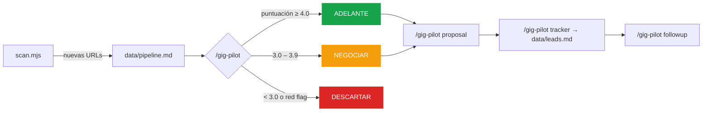

<div align="center">


<p><a href="README.md">English</a> · <a href="README.es.md">Español</a></p>


<p><strong>Tu pipeline de freelance en piloto automático — desde la terminal.</strong></p>

<p>
  Agrega ofertas puntuales y de colaboración, las puntúa por encaje y legitimidad,<br />
  redacta propuestas según el canal y hace seguimiento de cada lead. Sin base de datos, sin servidor, sin suscripción.
</p>

<p>
  <a href="#úsalo-desde-la-interfaz-web">Interfaz web</a> ·
  <a href="#inicio-rápido">Inicio rápido</a> ·
  <a href="#modos">Modos</a> ·
  <a href="#cómo-funciona">Cómo funciona</a> ·
  <a href="#el-sistema-de-puntuación">Puntuación</a> ·
  <a href="#arquitectura">Arquitectura</a> ·
  <a href="#contribuir">Contribuir</a>
</p>

<p>
  <a href="LICENSE"></a>
  
  
  <a href="https://github.com/pertuzdev/gig-pilot/commits"></a>
  <a href="CONTRIBUTING.md"></a>
</p>

</div>

---

Trabajar como freelance es un puesto de ventas al que nunca te apuntaste. Buscar ofertas, filtrarlas, escribir propuestas y perseguir seguimientos se come las horas que preferirías dedicar a construir. gig-pilot ejecuta ese pipeline por ti y te devuelve tu tiempo — mientras cada archivo permanece en tu máquina y Git es tu única capa de sincronización.

## Úsalo desde la interfaz web

¿Prefieres hacer clic antes que escribir comandos? gig-pilot incluye una **interfaz web** opcional. Todo lo que puedes hacer desde la terminal — escanear fuentes, evaluar gigs, generar propuestas, rastrear leads, editar tu configuración — está disponible en el navegador. Los archivos planos siguen siendo la fuente de verdad, y las acciones de IA se ejecutan a través de tu agente CLI local (Claude Code o Codex).

**Arráncala con un solo comando:**

```bash
# Modo desarrollo — web en :5273, API en :4317, ambas con recarga en vivo
npm run ui:dev
```

Luego abre **http://localhost:5273** en tu navegador.

```bash
# Modo producción — un solo proceso sirve la app compilada + la API en :4317
npm run ui:build      # compila el front-end una vez
npm run ui            # → http://127.0.0.1:4317
```

> [!NOTE]
> Las acciones de IA (**Evaluar**, **Generar propuesta**, **Analizar patrones**) lanzan tu agente CLI local dentro del repo y transmiten la salida al panel de consola. Esto requiere **Claude Code** o **Codex** instalado y con sesión iniciada. Revisa **Settings** dentro de la app para ver indicadores de estado en vivo y elegir tu proveedor. Consulta [`apps/README.md`](apps/README.md) para todas las opciones.


¿Prefieres la terminal? Sigue leyendo — el resto de esta guía cubre el flujo por CLI.

## Qué hace

| Etapa | Qué ocurre |
|-------|------------|
| **Escanear** | Rastrea Reddit (`r/forhire`, `r/jobbit`…), RemoteOK, WorkingNomads y más en busca de ofertas nuevas |
| **Evaluar** | Puntúa cada gig de 1 a 5 en seis bloques ponderados: Encaje de Arquetipo · Realismo del Presupuesto · Claridad del Alcance · Legitimidad del Poster · Canal y Términos · Timing |
| **Marcar** | Detecta trampas de "colaboración" no pagada, ofertas solo con equity, scope creep y cuentas poco fiables |
| **Proponer** | Redacta DMs y correos breves y adaptados al canal — nunca una carta de presentación genérica |
| **Rastrear** | Registra cada lead en `data/leads.md` con estado, tarifa y próximo seguimiento |
| **Seguimiento** | Recuerda según la cadencia — los DMs se enfrían rápido (3 días por defecto vs. 7 para correo) |

## Inicio rápido

```bash
# 1. Instálalo como plugin de Claude Code
#    En Claude Code:  /plugins install   (o añade este directorio como plugin local)

# 2. Copia las plantillas de configuración
cp config/profile.example.yml config/profile.yml
cp templates/sources.example.yml sources.yml

# 3. Edita tu perfil — servicios, tarifas, arquetipos de gig ideal
$EDITOR config/profile.yml

# 4. Ejecuta el doctor (revisa config, fuentes y conectividad)
node doctor.mjs

# 5. Escanea en busca de gigs
node scan.mjs

# 6. Evalúa uno — pega una URL o brief justo después del comando
#    En Claude Code:  /gig-pilot https://reddit.com/r/forhire/comments/...
```

No hacen falta claves de API para empezar — Reddit, RemoteOK y WorkingNomads son públicas y gratuitas. La evaluación basada en Gemini es opcional.

## Cómo funciona



Todo son archivos planos. `scan.mjs` llena una bandeja de entrada, los modos de IA evalúan y redactan, y el tracker es una tabla Markdown que puedes leer, editar y versionar en Git.

## Modos

gig-pilot es **un único slash-command con un router**: `/gig-pilot <modo>`, ejecutado dentro de Claude Code (o cualquier agente compatible). Ejecuta `/gig-pilot` sin argumentos para ver el menú. Si pegas una URL o brief sin modo, va directo al pipeline completo (evaluar → informe → tracker).

| Comando | Qué hace |
|---------|----------|
| `/gig-pilot <url o brief>` | Pipeline completo — evalúa, escribe un informe y lo añade al tracker |
| `/gig-pilot gig` | Solo evaluación — puntúa encaje, presupuesto, alcance y legitimidad |
| `/gig-pilot proposal` | Genera una propuesta a medida por DM o correo para un gig apto |
| `/gig-pilot pipeline` | Procesa `data/pipeline.md`, un gig a la vez |
| `/gig-pilot scan` | Descubre gigs desde tus fuentes configuradas |
| `/gig-pilot batch` | Evalúa varios gigs a la vez |
| `/gig-pilot tracker` | Consulta y gestiona tu tracker de leads |
| `/gig-pilot followup` | Revisa la cadencia de seguimiento y redacta el próximo mensaje |
| `/gig-pilot patterns` | Analiza tus patrones de éxito/fracaso a lo largo del tiempo |
| `/gig-pilot deep` | Investigación a fondo sobre un poster o empresa |
| `/gig-pilot agent-inbox` | Tría gigs pendientes de una decisión |
| `/gig-pilot pdf` | Genera un CV en PDF |
| `/gig-pilot update` | Comprueba si hay actualizaciones del sistema |

## El sistema de puntuación

Cada gig se puntúa **de 1 a 5 en seis bloques ponderados** y se resume en un veredicto:

| Bloque | Peso | Mide |
|--------|:----:|------|
| Encaje de Arquetipo | 25% | ¿Encaja con tus servicios? |
| Realismo del Presupuesto | 25% | ¿La paga es justa y real? |
| Claridad del Alcance | 20% | ¿El entregable está bien definido? |
| Legitimidad del Poster | 15% | ¿El poster es creíble? |
| Canal y Términos | 10% | ¿El canal de contratación es razonable? |
| Timing y Urgencia | 5% | ¿El plazo es realista? |

| Veredicto | Puntuación | Acción |
|-----------|-----------|--------|
| **ADELANTE** | ≥ 4.0 | Redacta una propuesta |
| **NEGOCIAR** | 3.0 – 3.9 | Continúa solo si se cumplen condiciones concretas |
| **DESCARTAR** | < 3.0 | Rechazo directo |

> [!IMPORTANT]
> **Realismo del Presupuesto = 1 es siempre un rechazo directo** — no se genera ninguna propuesta, por muy bueno que sea el encaje.

Disparadores habituales de rechazo directo:

- `"unpaid"` / `"for your portfolio"` / `"for exposure"`
- `"equity only"` / `"revenue share as payment"`
- Presupuesto por debajo de tu tarifa mínima (walk-away)

Consulta [`modes/_shared.md`](modes/_shared.md) para la rúbrica completa.

## Arquitectura

gig-pilot es un pipeline de archivos planos guiado por configuración — no una app web. Hay dos capas de archivos, y nunca se confunden:

```
Capa de Usuario  ·  tus datos, nunca se actualizan solos
├── config/profile.yml      identidad, servicios, tarifas
├── sources.yml             configuración de tus fuentes de gigs
├── data/leads.md           tu tracker de contactos (fuente de verdad)
├── data/pipeline.md        bandeja de entrada de URLs
└── reports/                tus informes de evaluación

Capa de Sistema  ·  lógica y scripts, seguro actualizar
├── modes/*.md              modos de prompt de IA
├── providers/*.mjs         plugins de fuentes de gigs
└── scan.mjs, tracker.mjs   utilidades
```

> [!WARNING]
> **La regla de oro: nunca actualices automáticamente los archivos de la Capa de Usuario.** Ni siquiera para "arreglarlos". El contrato completo está en [`DATA_CONTRACT.md`](DATA_CONTRACT.md).

Todos los scripts son JavaScript ESM plano (`*.mjs`) — sin paso de build. `data/leads.db` es un índice SQLite derivado y se puede borrar sin problema (se reconstruye con `node tracker.mjs sync`).

## Fuentes

| Proveedor | Fuente | Auth |
|-----------|--------|:----:|
| `reddit` | Feeds Atom RSS de `/new` por subreddit (`r/forhire`, `r/jobbit`…) | Ninguna |
| `hn` | Hilos de Hacker News "Freelancer" y "Who is hiring" vía API de Algolia | Ninguna |
| `getonboard` | API de Get on Board (getonbrd.com) | Ninguna |
| `remoteok` | API de RemoteOK.com | Ninguna |
| `workingnomads` | API de WorkingNomads.com | Ninguna |

Los proveedores solo obtienen y normalizan — todo el filtrado vive en `scan.mjs`. Añadir una fuente es un único archivo en [`providers/`](providers/).

## Mantenerlo actualizado

```bash
node update-system.mjs        # → { "status": "up-to-date" }  o  { "status": "update-available", … }
```

Solo se tocan los archivos de la Capa de Sistema. Tu perfil, fuentes, tracker e informes quedan exactamente como los dejaste.

## Contribuir

Las contribuciones son bienvenidas — especialmente nuevas fuentes, mejoras de modos, documentación y packs de idioma.

- Lee [`CONTRIBUTING.md`](CONTRIBUTING.md) y el [`CODE_OF_CONDUCT.md`](CODE_OF_CONDUCT.md)
- Gobernanza del proyecto [`GOVERNANCE.md`](GOVERNANCE.md) · [`SECURITY.md`](SECURITY.md)
- Añade un idioma en `modes/{lang}/` siguiendo la estructura existente
- Ejecuta la suite de tests antes de abrir un PR

## Licencia

[MIT](LICENSE) — hecho para quienes prefieren construir antes que vender.
