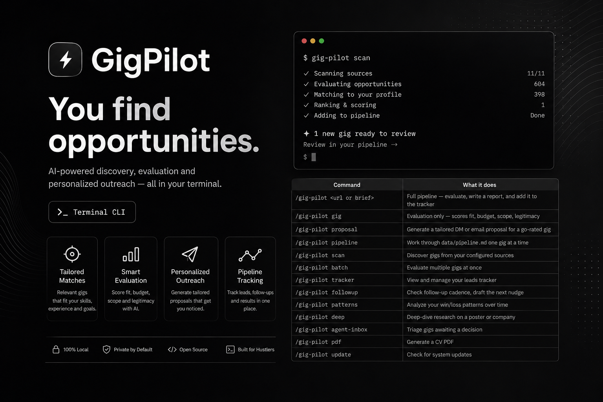
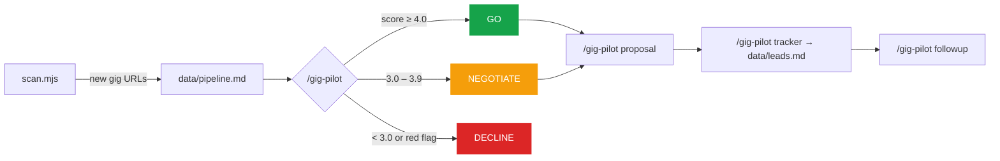

<div align="center">


<p><a href="README.md">English</a> · <a href="README.es.md">Español</a></p>



<p><strong>Your freelance pipeline, on autopilot — from the terminal.</strong></p>

<p>
  Aggregates on-demand & collaboration postings, scores them for fit and legitimacy,<br />
  drafts channel-aware proposals, and tracks every lead. No database, no server, no subscription.
</p>

<p>
  <a href="#use-it-from-the-web-interface">Web UI</a> ·
  <a href="#quickstart">Quickstart</a> ·
  <a href="#modes">Modes</a> ·
  <a href="#how-it-works">How it works</a> ·
  <a href="#the-scoring-system">Scoring</a> ·
  <a href="#architecture">Architecture</a> ·
  <a href="#contributing">Contributing</a>
</p>

<p>
  <a href="LICENSE"></a>
  
  
  <a href="https://github.com/pertuzdev/gig-pilot/commits"></a>
  <a href="CONTRIBUTING.md"></a>
</p>

</div>

---

Freelancing is a sales job you never signed up for. Sourcing, vetting, writing proposals, and chasing follow-ups eats the hours you'd rather spend building. gig-pilot runs that pipeline for you and hands back your time — while every file stays on your machine and Git stays your only sync layer.

## Use it from the web interface

Prefer clicking to typing? gig-pilot ships an optional **web UI**. Everything you can do from the terminal — scan sources, evaluate gigs, generate proposals, track leads, edit your config — is available in the browser. The flat files stay the source of truth, and AI actions still run through your local agent CLI (Claude Code or Codex).

**Start it in one command:**

```bash
# Dev mode — web on :5273, API on :4317, both with live reload
npm run ui:dev
```

Then open **http://localhost:5273** in your browser.

```bash
# Production mode — a single process serves the built app + API on :4317
npm run ui:build      # build the front-end once
npm run ui            # → http://127.0.0.1:4317
```

> [!NOTE]
> AI actions (**Evaluate**, **Generate proposal**, **Analyze patterns**) spawn your local agent CLI in the repo and stream the output to the console drawer. This requires **Claude Code** or **Codex** installed and logged in. Check the in-app **Settings** for live health indicators and to pick your provider. See [`apps/README.md`](apps/README.md) for all options.


Prefer the terminal? Keep reading — the rest of this guide covers the CLI workflow.

## What it does

| Stage | What happens |
|-------|--------------|
| **Scan** | Sweeps Reddit (`r/forhire`, `r/jobbit`…), RemoteOK, WorkingNomads and more for fresh postings |
| **Evaluate** | Scores each gig 1–5 across six weighted blocks: Archetype Fit · Budget Realism · Scope Clarity · Poster Legitimacy · Channel & Terms · Timing |
| **Flag** | Catches unpaid "collab" traps, equity-only offers, scope creep, and low-trust accounts |
| **Propose** | Drafts short, channel-aware DMs and emails — never a generic cover letter |
| **Track** | Logs every lead in `data/leads.md` with status, rate, and next follow-up |
| **Follow up** | Nudges on cadence — DMs go cold fast (3-day default vs. 7-day for email) |

## Quickstart

```bash
# 1. Install as a Claude Code plugin
#    In Claude Code:  /plugins install   (or add this directory as a local plugin)

# 2. Copy the config templates
cp config/profile.example.yml config/profile.yml
cp templates/sources.example.yml sources.yml

# 3. Edit your profile — services, rate card, ideal-gig archetypes
$EDITOR config/profile.yml

# 4. Run the doctor (checks config, sources, and connectivity)
node doctor.mjs

# 5. Scan for gigs
node scan.mjs

# 6. Evaluate one — paste a URL or brief straight after the command
#    In Claude Code:  /gig-pilot https://reddit.com/r/forhire/comments/...
```

No API keys required to get started — Reddit, RemoteOK, and WorkingNomads are all public and free. Gemini-based evaluation is optional.

## How it works



Everything is flat files. `scan.mjs` fills an inbox, the AI modes evaluate and draft, and the tracker is a plain Markdown table you can read, edit, and diff in Git.

## Modes

gig-pilot is a **single slash-command with a router**: `/gig-pilot <mode>`, run inside Claude Code (or any compatible agent). Run `/gig-pilot` with no argument to see the menu. Paste a gig URL or brief with no mode and it routes straight to the full pipeline (evaluate → report → track).

| Command | What it does |
|---------|--------------|
| `/gig-pilot <url or brief>` | Full pipeline — evaluate, write a report, and add it to the tracker |
| `/gig-pilot gig` | Evaluation only — scores fit, budget, scope, legitimacy |
| `/gig-pilot proposal` | Generate a tailored DM or email proposal for a go-rated gig |
| `/gig-pilot pipeline` | Work through `data/pipeline.md` one gig at a time |
| `/gig-pilot scan` | Discover gigs from your configured sources |
| `/gig-pilot batch` | Evaluate multiple gigs at once |
| `/gig-pilot tracker` | View and manage your leads tracker |
| `/gig-pilot followup` | Check follow-up cadence, draft the next nudge |
| `/gig-pilot patterns` | Analyze your win/loss patterns over time |
| `/gig-pilot deep` | Deep-dive research on a poster or company |
| `/gig-pilot agent-inbox` | Triage gigs awaiting a decision |
| `/gig-pilot pdf` | Generate a CV PDF |
| `/gig-pilot update` | Check for system updates |

## The scoring system

Every gig is scored **1–5 across six weighted blocks**, then rolled into one verdict:

| Block | Weight | Measures |
|-------|:------:|----------|
| Archetype Fit | 25% | Does it match your services? |
| Budget Realism | 25% | Is the pay fair and real? |
| Scope Clarity | 20% | Is the deliverable well-defined? |
| Poster Legitimacy | 15% | Is the poster credible? |
| Channel & Terms | 10% | Is the engagement channel sane? |
| Timing & Urgency | 5% | Is the timeline realistic? |

| Verdict | Score | Action |
|---------|-------|--------|
| **GO** | ≥ 4.0 | Draft a proposal |
| **NEGOTIATE** | 3.0 – 3.9 | Pursue only if specific conditions are met |
| **DECLINE** | < 3.0 | Hard pass |

> [!IMPORTANT]
> **Budget Realism = 1 is always a hard decline** — no proposal is generated, no matter how good the fit.

Common hard-decline triggers:

- `"unpaid"` / `"for your portfolio"` / `"for exposure"`
- `"equity only"` / `"revenue share as payment"`
- Budget below your walk-away rate

See [`modes/_shared.md`](modes/_shared.md) for the full rubric.

## Architecture

gig-pilot is a config-driven, flat-file pipeline — not a web app. There are two layers of files, and they are never confused:

```
User Layer  ·  your data, never auto-updated
├── config/profile.yml      identity, services, rate card
├── sources.yml             your gig sources config
├── data/leads.md           your outreach tracker (source of truth)
├── data/pipeline.md        incoming URL inbox
└── reports/                your gig evaluation reports

System Layer  ·  logic & scripts, safe to update
├── modes/*.md              AI prompt modes
├── providers/*.mjs         gig source plugins
└── scan.mjs, tracker.mjs   utilities
```

> [!WARNING]
> **The cardinal rule: never auto-update User Layer files.** Not even to "fix" them. The full contract is in [`DATA_CONTRACT.md`](DATA_CONTRACT.md).

All scripts are plain ESM JavaScript (`*.mjs`) — no build step. `data/leads.db` is a derived SQLite index and is safe to delete (rebuilt via `node tracker.mjs sync`).

## Sources

| Provider | Source | Auth |
|----------|--------|:----:|
| `reddit` | Subreddit `/new` Atom RSS feeds (`r/forhire`, `r/jobbit`…) | None |
| `hn` | Hacker News "Freelancer" & "Who is hiring" threads via Algolia API | None |
| `getonboard` | Get on Board (getonbrd.com) API | None |
| `remoteok` | RemoteOK.com API | None |
| `workingnomads` | WorkingNomads.com API | None |

Providers only fetch and normalize — all filtering lives in `scan.mjs`. Adding a source is a single file in [`providers/`](providers/).

## Keeping it updated

```bash
node update-system.mjs        # → { "status": "up-to-date" }  or  { "status": "update-available", … }
```

Only System Layer files are ever touched. Your profile, sources, tracker, and reports stay exactly as you left them.

## Contributing

Contributions are welcome — new providers, mode improvements, docs, and locale packs especially.

- Read [`CONTRIBUTING.md`](CONTRIBUTING.md) and the [`CODE_OF_CONDUCT.md`](CODE_OF_CONDUCT.md)
- Project [`GOVERNANCE.md`](GOVERNANCE.md) · [`SECURITY.md`](SECURITY.md)
- Add a locale under `modes/{lang}/` following the existing structure
- Run the test suite before opening a PR

## License

[MIT](LICENSE) — built for people who'd rather build than sell.
